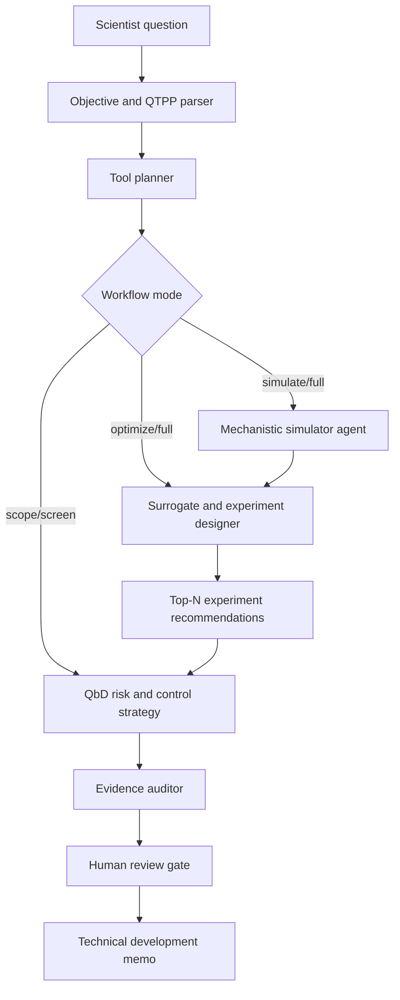

# CMC Agent Lab

**An auditable AI workbench for late-stage pharmaceutical process development: LangGraph
orchestration, mechanistic first-principles simulators, surrogate modeling, adaptive experiment
planning, QbD risk controls, and scientist review.**

This project is designed for pharmaceutical technology and development work, not generic RAG
and not early discovery. The core question is:

> Given a molecule, product target, development constraints, and limited experimental history,
> which model-backed experiments should a process scientist run next to improve critical quality
> attributes while preserving auditability?

## Why This Project

Most agent demos show a planner calling a few APIs. CMC Agent Lab is structured around the
harder product problem that late-stage drug-development teams actually face:

- Experimental data is sparse because each wet-lab run is expensive.
- Mechanistic models are useful but domain-specific and sometimes computationally heavy.
- Surrogate ML can accelerate exploration but needs uncertainty and data lineage.
- Scientists do not always want the full workflow; they may ask for only risk review, only
  simulator routing, or only next-experiment recommendations.
- Regulated environments require traceable model and tool execution, not opaque autonomy.

## Agent Capabilities

The higher-purpose agent can run in flexible modes:

- **Scope:** translate a scientific/process question into CQAs, CPPs, constraints, and a plan.
- **Screen:** select a minimal tool plan without running expensive simulations.
- **Simulate:** run mechanistic models for stability, reaction conversion, crystallization, and
  dissolution/formulation screening.
- **Optimize:** recommend a constrained batch of next experiments using active learning or
  Bayesian-optimization-style acquisition.
- **Learn:** train a reinforcement-learning-style sequential experiment policy against the
  mechanistic simulator environment.
- **Risk:** build a QbD-style risk register connecting CPPs to CQAs.
- **Audit:** verify that the selected tools, assumptions, inputs, outputs, and decisions are
  recorded.
- **Full:** run the complete workflow.

The workflow is intentionally tool-flexible. The local implementation includes deterministic
first-principles-inspired simulators so the project runs anywhere. The registry also defines
adapters for open-source scientific tools such as PharmaPy, Cantera, IDAES/Pyomo, DWSIM, and
Thermo/Chemicals.

## Architecture



## Quickstart

```bash
python -m venv .venv
source .venv/bin/activate
python -m pip install -e ".[dev]"

cmc-agent-lab run examples/small_molecule_process.yaml \
  --output results/development-memo.md \
  --json results/state.json

cmc-agent-lab run examples/rl_experiment_policy.yaml \
  --output results/rl-policy-memo.md \
  --json results/rl-policy-state.json

python -m pip install -e ".[property]"
cmc-agent-lab run examples/property_package_screen.yaml

pytest
```

Without installing the package, from the repository root:

```bash
PYTHONPATH=src python -m cmc_agent_lab run examples/small_molecule_process.yaml
PYTHONPATH=src python -m pytest
```

## Demo Artifacts

Pre-generated outputs are included for quick review:

- [Full workflow memo](demo/full-workflow-memo.md)
- [Full workflow audit state](demo/full-workflow-state.json)
- [RL policy memo](demo/rl-policy-memo.md)
- [RL policy audit state](demo/rl-policy-state.json)
- [Thermo/Chemicals property-screen memo](demo/property-package-memo.md)
- [Thermo/Chemicals property-screen state](demo/property-package-state.json)

## Repository Map

```text
src/cmc_agent_lab/
  workflow.py                 Offline deterministic orchestration
  graph.py                    LangGraph assembly for stateful production orchestration
  registry.py                 Tool registry and optional open-source simulator detection
  planning.py                 Flexible tool-selection policy
  schema.py                   Typed state contracts
  agents/
    objective.py              Problem scoping and intent extraction
    tool_planner.py           Tool plan generation
    simulator.py              Simulator execution and adapter routing
    surrogate.py              Surrogate modeling readiness and fit summary
    experiment_designer.py    Top-N experiment recommendation
    rl_policy.py              Simulator-trained sequential experiment policy
    risk.py                   QbD/FMEA-style risk register
    auditor.py                Execution provenance and audit controls
    reporter.py               Development memo rendering
  simulators/
    builtin.py                Local first-principles-inspired ODE/mechanistic models
    adapters.py               Boundaries for PharmaPy, Cantera, IDAES, DWSIM, Thermo
  optimization/
    active_learning.py        Candidate generation and acquisition scoring
  rl/
    env.py                    Gym-like simulator-backed experiment environment
    reward.py                 CQA-weighted reward and constraint penalties
    policy.py                 Epsilon-greedy sequential experiment policy
docs/
  research-brief.md           Literature and tool research
  simulator-stack.md          Open-source simulator strategy
  architecture.md             Agent architecture and state model
  reinforcement-learning.md   RL formulation and roadmap
  product-plan.md             Build roadmap and demo story
  evaluation.md               Evaluation strategy
examples/
  small_molecule_process.yaml Repeatable process-development scenario
  rl_experiment_policy.yaml   Simulator-backed RL experiment-policy scenario
  property_package_screen.yaml Thermo/Chemicals solvent-property screen
demo/
  full-workflow-memo.md       Generated technical development memo
  rl-policy-memo.md           Generated RL policy memo
tests/
```

## Research Base

This project is grounded in process-development and manufacturing literature rather than generic
agent trends:

- PharmaPy open-source pharmaceutical process simulation and flowsheets.
- Digital twins and mechanistic/hybrid modeling for pharmaceutical manufacturing.
- Population-balance modeling for crystallization.
- Bayesian optimization and active learning for formulation and chemical process experiments.
- FDA PAT, ICH Q8, and ICH Q9 expectations around process understanding, critical quality
  attributes, risk management, and auditability.

See [docs/research-brief.md](docs/research-brief.md) and
[docs/simulator-stack.md](docs/simulator-stack.md) for the detailed source-backed plan.
See [docs/reinforcement-learning.md](docs/reinforcement-learning.md) for the RL formulation.

## Positioning

The portfolio value is not "AI can code an agent." The value is showing product and technical
judgment:

> Translate late-stage pharmaceutical development decisions into an auditable AI system that
> knows when to use mechanistic models, when to use surrogate ML, when to ask a scientist for
> review, and how to recommend fewer, better experiments.
